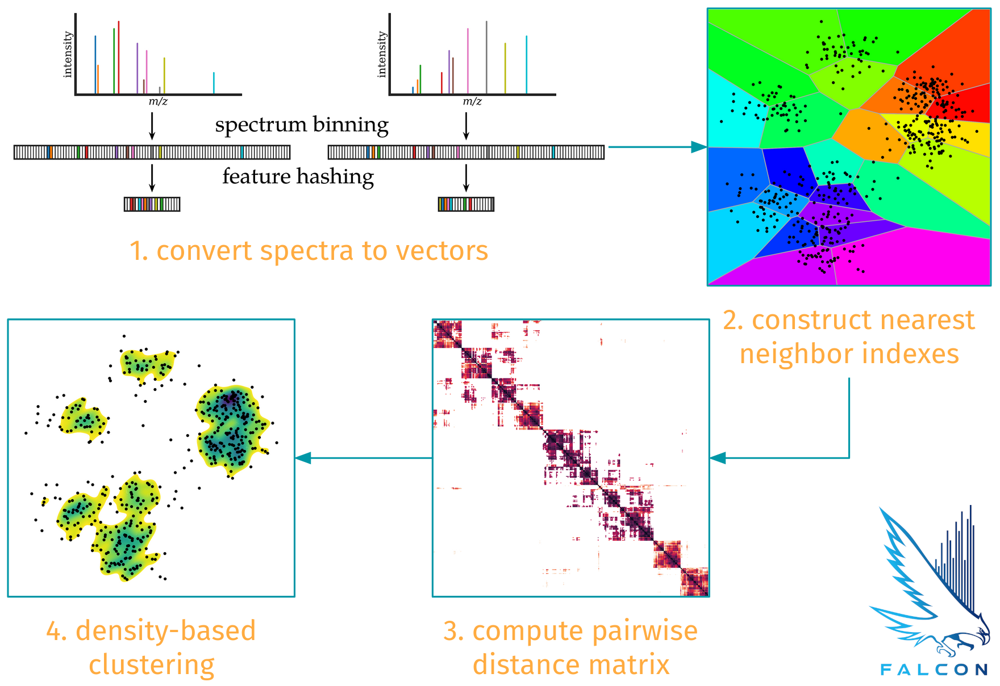

_falcon_
========

For more information:

* [Official code website](https://github.com/bittremieux/falcon)

The _falcon_ spectrum clustering tool uses advanced algorithmic techniques for
highly efficient processing of millions of MS/MS spectra. First,
high-resolution spectra are binned and converted to low-dimensional vectors
using feature hashing. Next, the spectrum vectors are used to construct nearest
neighbor indexes for fast similarity searching. The nearest neighbor indexes
are used to efficiently compute a sparse pairwise distance matrix without
having to exhaustively compare all spectra to each other. Finally,
density-based clustering is performed to group similar spectra into clusters.

The software is available as open-source under the BSD license.

If you use _falcon_ in your work, please cite the following publication:

- Wout Bittremieux, Kris Laukens, William Stafford Noble, Pieter C. Dorrestein.
**Large-scale tandem mass spectrum clustering using fast nearest neighbor
searching.** _publication pending_ (2021).

Installation
------------

_falcon_ requires Python 3.8+ and can be installed with pip:

    pip install git+https://github.com/bittremieux/falcon.git

Running _falcon_
----------------

_falcon_ can be run from the command line, with settings specified as
command-line arguments or set in an INI config file. _falcon_ takes peak files
(in the mzML, mzXML, or MGF format) as input and exports the clustering result
as a comma-separated file with each MS/MS spectrum and its cluster label on a
single line. Representative spectra for each cluster can optionally be exported
to an MGF file.

Example _falcon_ run with some relevant command-line arguments:

    falcon peak/*.mzml falcon --export_representatives --precursor_tol 20 ppm --fragment_tol 0.05 --eps 0.10

This will cluster all MS/MS spectra in mzML files in the `peak` directory with
the specified settings and write (i) the cluster assignments to the `falcon.csv` file, and (ii) the cluster representatives to the `falcon.mgf` file.

For detailed information on all available settings, run `falcon -h` or
`falcon --help`.

Important settings
------------------

Here we provide information on the most important settings that influence the
_falcon_ clustering performance. All settings have sensible default values
which should give good results for a wide variety of datasets.

**Spectrum comparison**

- `precursor_tol`: The precursor mass tolerance and unit (in ppm or Dalton) to
compare spectra to each other.
- `fragment_tol`: The fragment mass tolerance (in Dalton) used during spectrum
comparison.

**Clustering**

- `eps`: The maximum cosine distance between two spectra for them to be
considered as neighbors of each other. This parameter crucially governs cluster
purity (i.e. clusters contain spectra corresponding to only a single peptide).
The ideal value of this parameter depends on the spectral characteristics of
your data and optional spectrum preprocessing configured in _falcon_. Values
between 0.05 and 0.15 will typically generate a pure clustering result. For
more aggressive clustering values up to 0.30 can be used.

**Nearest neighbor indexing** (see below)

- `n_probe`: The maximum number of lists in the inverted index to inspect
during querying. Inspecting fewer lists will run faster but will give slightly
less accurate clustering results.
- `n_neighbors` and `n_neighbors_ann`: The final number of neighbors to
consider for each spectrum and during nearest neighbor searching. Querying less
neighbors will run faster but will give slightly less accurate clustering
results. `n_neighbors_ann` should be equal or greater than `n_neighbors`.
- `hash_len`: The length of the hashed vectors used for nearest neighbor
searching. Larger vectors will minimize the number of hash collisions and more
accurately approximate the true cosine distance, at the expense of longer
nearest neighbor searching and memory requirements.

**Spectrum preprocessing**

- There are several options to configure spectrum preprocessing prior to the
clustering. See the command-line documentation for more information.

How does it work?
-----------------

1. High-resolution MS/MS spectra are converted to low-dimensional vectors using
feature hashing. First, spectra are converted to sparse vectors using small
mass bins to tightly capture their fragment masses. Next, the sparse,
high-dimensional, vectors are hashed to lower-dimensional vectors by using a
hash function (the non-cryptographic MurmurHash3 algorithm) to map the mass
bins separately to a small number of hash bins. This feature hashing conserves
the cosine similarity between hashed vectors and can be used to approximate the
similarity between the original spectra.
2. Vectors are split into buckets based on the precursor _m_/_z_ of the
corresponding spectra to construct nearest neighbor indexes for highly
efficient spectrum comparison. The spectrum vectors in each bucket are
partitioned into data subspaces to create a Voronoi diagram, and all vectors
are assigned to their nearest representative vector in an inverted index.
3. A sparse pairwise distance matrix is computed by retrieving similarities to
neighboring spectra using the nearest neighbor indexes. The accuracy and speed
of similarity searching is governed by the number of neighboring cells to
explore during searching: exploring more cells during searching decreases the
chance of missing a nearest neighbor in the high-dimensional space, at the
expense of a longer searching time.
4. Density-based clustering using the pairwise distance matrix is performed to
find spectrum clusters. The DBSCAN algorithm is used to find spectra that are
close to each other and that form a dense data subspace, and group them into
clusters.

Contact
-------

For more information you can visit the
[official code website](https://github.com/bittremieux/falcon) or send an email
to <wbittremieux@health.ucsd.edu>.
